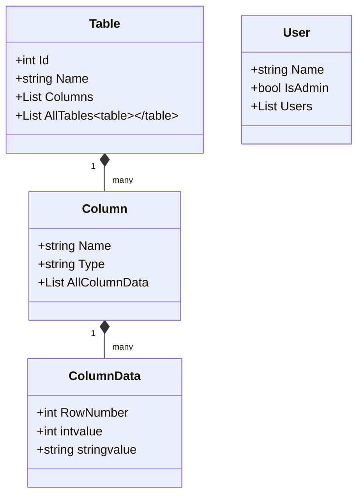

# Database Simulation Project

**Final Project for Advanced Programming Course**  
*A simple database simulation demonstrating core concepts and object-oriented design principles.*

## Overview
This project is a console-based database management system (DBMS) simulator, developed as the final assignment for an Advanced Programming course. It models basic database operations with user access control, table manipulation, and data querying capabilities.

## Key Features

### 1. User Management System
- Two user roles: Admin (full access) and Viewer (read-only)
- User creation command: `create user [username] [editor/viewer]`

### 2. Table Operations
- Create/delete tables: `create table [tablename] [username]`
- Column management:
  - Add/remove columns with data typing (`int`/`string`)
  - Automatic data initialization for existing rows
- Row manipulation:
  - Add/remove rows with position management
  - Data modification: `change [table] [row] [column] [value] [user]`

### 3. Data Querying
- Full table printing with sorting capabilities
- Column-specific search: `search [table] [column] [value]`
- Multi-column sorting using stable sorting algorithm

### 4. Access Control
- Command validation through extension methods
- Admin privileges required for write operations

## Technical Components

### Core Models
1. **Table**: Contains columns and manages table metadata
2. **Column**: Typed data storage (int/string) with row management
3. **User**: Role-based access control implementation
4. **RowForCompare**: Helper class for sorting operations

### System Architecture


## Getting Started

### Requirements
- .NET 7.0 Runtime
- Visual Studio 2022 (recommended)

### Example Usage
1. Create admin user:
   ```
   create user admin1 editor
   ```

2. Create table:
   ```
   create table Customers admin1
   ```

3. Add columns:
   ```
   add column Customers Name string admin1
   add column Customers Age int admin1
   ```

4. Insert data:
   ```
   add row Customers admin1
   change Customers 1 Name "Alice" admin1
   change Customers 1 Age 28 admin1
   ```

5. Query data:
   ```
   print Customers * admin1
   search Customers Age 28 admin1
   ```

## Design Patterns
- Singleton Pattern: Used for maintaining global table/user lists
- Factory Pattern: Column data creation based on type
- Extension Methods: Access control implementation

## Academic Context
This project demonstrates:
- Object-oriented design principles
- Collection management and LINQ operations
- Role-based access control implementation
- Complex sorting algorithms
- Type-safe data handling
- Console application architecture

## Limitations
- In-memory storage (no persistence)
- Basic error handling
- Limited to two data types (int/string)
- Simple sorting implementation

## License
Academic Free License - For educational purposes only.
